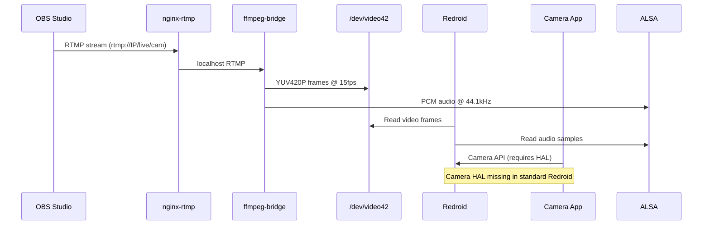
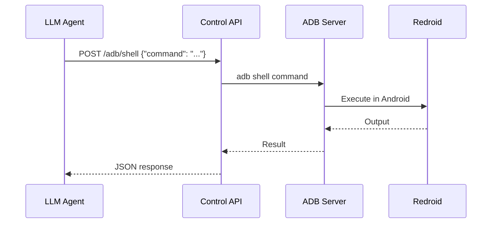
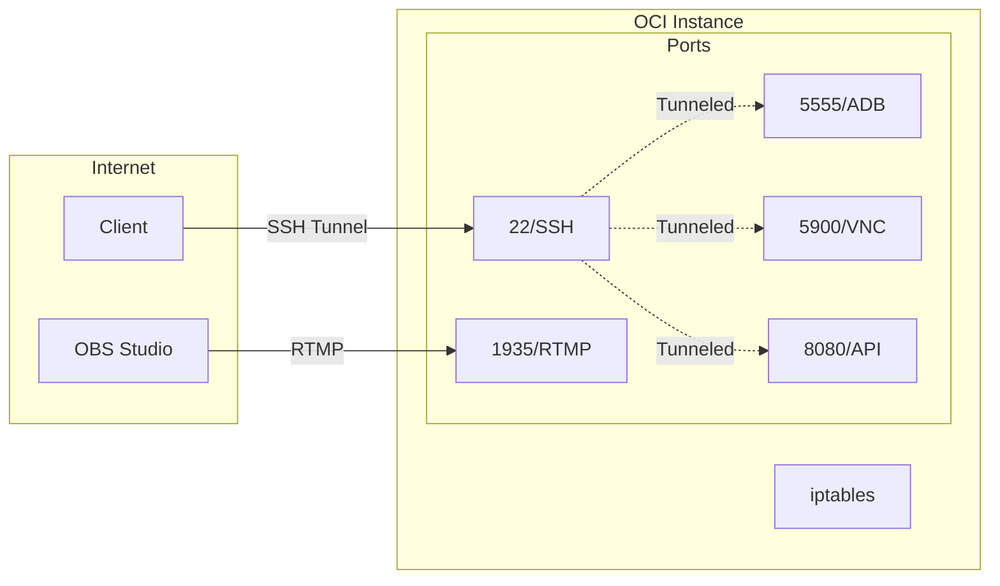
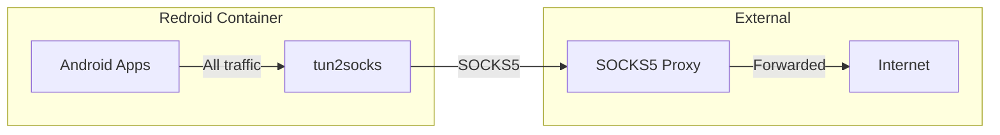

# Architecture

This document describes the system architecture of the Redroid Cloud Phone project.

## System Overview

```mermaid
graph TB
    subgraph "External"
        OBS[OBS Studio]
        User[User/Agent]
    end

    subgraph "OCI Instance"
        subgraph "Streaming Pipeline"
            NGINX[nginx-rtmp<br/>:1935]
            FFMPEG[ffmpeg-bridge]
            V4L2[/dev/video42<br/>v4l2loopback]
            ALSA[ALSA Loopback<br/>snd-aloop]
        end

        subgraph "Android Container"
            REDROID[Redroid Docker<br/>Android 11]
            ADB[ADB Server<br/>:5555]
            VNC[VNC Server<br/>:5900]
        end

        subgraph "Control Layer"
            API[Control API<br/>:8080]
            ORCH[Orchestrator<br/>:8000]
        end
    end

    OBS -->|RTMP Stream| NGINX
    NGINX -->|localhost RTMP| FFMPEG
    FFMPEG -->|Video Frames| V4L2
    FFMPEG -->|Audio PCM| ALSA
    V4L2 -->|Virtual Camera| REDROID
    ALSA -->|Virtual Mic| REDROID
    
    User -->|SSH/scrcpy| ADB
    User -->|VNC Client| VNC
    User -->|REST API| API
    API -->|ADB Commands| REDROID
    ORCH -->|Coordinates| API
```

## Component Details

### Streaming Pipeline

| Component | Service | Port | Purpose |
|-----------|---------|------|---------|
| nginx-rtmp | `nginx-rtmp.service` | 1935 | RTMP ingest from OBS |
| ffmpeg-bridge | `ffmpeg-bridge.service` | - | Transcode RTMP to virtual devices |
| v4l2loopback | kernel module | /dev/video42 | Virtual camera device |
| snd-aloop | kernel module | hw:Loopback | Virtual audio device |

### Android Container

| Component | Service | Port | Purpose |
|-----------|---------|------|---------|
| Redroid | `redroid-container.service` | - | Android 11 in Docker |
| ADB | exposed by Redroid | 5555 | Android Debug Bridge |
| VNC | built into Redroid | 5900 | Screen viewing |

### Control Layer

| Component | Service | Port | Purpose |
|-----------|---------|------|---------|
| Control API | `control-api.service` | 8080 | REST API for automation |
| Orchestrator | `orchestrator.service` | 8000 | Multi-instance coordination |

## Data Flow

### Video/Audio Streaming



### API Control Flow



## Directory Structure

```
/opt/
├── cloud-phone-api/          # Control API
│   ├── server.py
│   └── requirements.txt
├── redroid-scripts/          # Operational scripts
│   ├── ffmpeg-bridge.sh
│   ├── health-check.sh
│   ├── install-gapps.sh
│   └── ...
├── redroid-data/             # Redroid persistent data
└── gapps/                    # Google Apps packages

/etc/systemd/system/
├── redroid-container.service
├── control-api.service
├── nginx-rtmp.service
├── ffmpeg-bridge.service
└── redroid-cloud-phone.target
```

## Network Architecture



**Security Note:** ADB (5555), VNC (5900), and API (8080) should be accessed via SSH tunnel. Only ports 22 (SSH) and 1935 (RTMP) need to be open in OCI security lists.

## Proxy Architecture (Optional)



When proxy is enabled via `socks5-toggle.sh`, all Android network traffic routes through the specified SOCKS5 proxy.

## Known Limitations

### Camera HAL

Standard Redroid images do not include a Camera HAL (Hardware Abstraction Layer). This means:

- `/dev/video42` is accessible inside the container ✅
- Android's CameraService runs ✅
- **But apps cannot detect cameras** ❌

```
CameraService → Camera Provider → camera.v4l2.so → /dev/video42
                     ↑
                 MISSING
```

**Workaround:** Use VLC app to view RTMP stream directly (`rtmp://127.0.0.1/live/cam`).

See [docs/CAMERA_HAL_FIX.md](CAMERA_HAL_FIX.md) for potential solutions.

## Resource Requirements

| Resource | Minimum | Recommended |
|----------|---------|-------------|
| OCPUs | 1 | 2 |
| Memory | 4GB | 8GB |
| Disk | 20GB | 50GB |
| Ubuntu | 20.04 | 20.04 |
| Kernel | 5.x | 5.15+ |

**Note:** Ubuntu 20.04 with kernel 5.x is required for v4l2loopback and snd-aloop module compatibility.
