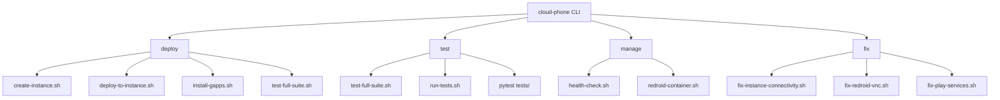

# Development Guide

This guide covers development workflow, testing, scripts reference, and contribution guidelines.

## Unified CLI Tool

The `cloud-phone` script in the project root provides a single entry point for all operations:

```bash
./cloud-phone <command> [options]
```

### Available Commands

| Command | Description |
|---------|-------------|
| `deploy` | Deploy new instance or to existing instance |
| `test` | Run tests (unit, integration, e2e, api) |
| `manage` | Manage running instances (start, stop, restart, status) |
| `fix` | Apply hotfixes and repairs |
| `tunnel` | Manage SSH tunnels for remote access |
| `proxy` | Configure proxy settings |
| `build` | Build custom Docker images |
| `install` | Install on local/remote system |
| `status` | Show system status and health |
| `logs` | View logs from services |

### Quick Examples

```bash
# Full deployment (create + deploy + test)
./cloud-phone deploy --full --name my-phone

# Deploy to existing instance
./cloud-phone deploy --to-instance 129.146.x.x

# Run all tests
./cloud-phone test --all

# Apply all hotfixes
./cloud-phone fix --all

# Start SSH tunnel
./cloud-phone tunnel --start 129.146.x.x

# Check status
./cloud-phone status
```

Run `./cloud-phone <command> --help` for command-specific options.

## Development Workflow

### Recommended Approach (Hybrid)

Use a combination of cloud/remote development and local testing:

| Task | Best Environment |
|------|------------------|
| Code editing, scripting | Cloud Agent / Local IDE |
| Remote testing | Cloud Agent (SSH) |
| Visual testing (VNC) | Local machine |
| ADB interactive testing | Local machine |

### Development Cycle

```bash
# 1. Make code changes locally or via agent

# 2. Deploy to instance
scp -r scripts/ ubuntu@<IP>:/opt/redroid-scripts/
ssh ubuntu@<IP> 'sudo systemctl restart control-api'

# 3. Run automated tests
VM_HOST=<IP> pytest tests/ -v

# 4. Visual verification (local)
ssh -L 5900:localhost:5900 ubuntu@<IP> -N
vncviewer localhost:5900

# 5. Fix issues and repeat
```

## Testing

### Test Structure

```
tests/
├── test_streaming_unit.py        # Unit tests (17 tests)
├── test_streaming_integration.py # Integration tests (18 tests)
├── test_streaming_e2e.py         # End-to-end tests (20 tests)
├── test_virtual_camera.py        # Virtual camera tests (20 tests)
├── test_agent_api.py             # API tests
├── test_connectivity.py          # Network connectivity tests
└── test_orchestrator_*.py        # Orchestrator tests
```

### Running Tests

```bash
# Setup
python3 -m venv .venv
source .venv/bin/activate
pip install pytest

# Set target VM
export VM_HOST=132.226.155.1

# Run all tests
pytest tests/ -v

# Run specific test files
pytest tests/test_streaming_unit.py -v
pytest tests/test_virtual_camera.py -v

# Run with output
pytest tests/ -v --tb=short
```

### Test Categories

| Category | File | Tests | Description |
|----------|------|-------|-------------|
| Unit | `test_streaming_unit.py` | 17 | Service configs, files exist |
| Integration | `test_streaming_integration.py` | 18 | Services running, connected |
| E2E | `test_streaming_e2e.py` | 20 | Full pipeline verification |
| Virtual Camera | `test_virtual_camera.py` | 20 | Camera/audio device tests |

### Writing Tests

Tests connect to the VM via SSH and run commands:

```python
def ssh_cmd(cmd: str, timeout: int = 30) -> tuple:
    """Run command via SSH and return (returncode, stdout, stderr)."""
    full_cmd = [
        "ssh", "-o", "ConnectTimeout=10", "-o", "StrictHostKeyChecking=no",
        f"{SSH_USER}@{VM_HOST}", cmd
    ]
    result = subprocess.run(full_cmd, capture_output=True, text=True, timeout=timeout)
    return result.returncode, result.stdout.strip(), result.stderr.strip()

class TestExample:
    def test_service_running(self):
        code, out, _ = ssh_cmd("sudo systemctl is-active nginx-rtmp")
        assert code == 0 and out == "active"
```

## Scripts Reference

All scripts are in the `scripts/` directory and can be called directly or via the `cloud-phone` CLI.

### Deployment Scripts

| Script | Description | Usage |
|--------|-------------|-------|
| `deploy-cloud-phone.sh` | Full deployment with config options | `./scripts/deploy-cloud-phone.sh --name my-phone --ocpus 2` |
| `deploy-from-golden.sh` | Fast deployment from golden image | `./scripts/deploy-from-golden.sh my-phone` |
| `deploy-to-instance.sh` | Deploy to existing instance | `./scripts/deploy-to-instance.sh 129.146.x.x ~/.ssh/key` |
| `deploy-and-test.sh` | Deploy and run test suite | `./scripts/deploy-and-test.sh` |
| `create-instance.sh` | Create OCI instance only | `./scripts/create-instance.sh my-phone` |
| `create-golden-image.sh` | Create OCI custom image | `./scripts/create-golden-image.sh` |
| `prepare-golden-image.sh` | Prepare instance for imaging | `./scripts/prepare-golden-image.sh` |
| `launch-fleet.sh` | Launch multiple instances | `./scripts/launch-fleet.sh 5` |

### Testing Scripts

| Script | Description | Usage |
|--------|-------------|-------|
| `test-full-suite.sh` | Comprehensive test suite | `./scripts/test-full-suite.sh 129.146.x.x` |
| `run-tests.sh` | Test runner with logging | `./scripts/run-tests.sh --instance-ip 129.146.x.x` |
| `test-redroid.sh` | Quick Redroid validation | `./scripts/test-redroid.sh` |
| `test-redroid-full.sh` | Full Redroid test suite | `./scripts/test-redroid-full.sh 129.146.x.x` |
| `test-redroid-complete.sh` | Complete setup + test | `./scripts/test-redroid-complete.sh 129.146.x.x` |
| `test-api.sh` | API endpoint tests | `./scripts/test-api.sh` |
| `test-adb-vnc.sh` | ADB and VNC connectivity | `./scripts/test-adb-vnc.sh 129.146.x.x` |
| `test-rtmp-stream.sh` | RTMP streaming test | `./scripts/test-rtmp-stream.sh` |
| `test-audio-pipeline.sh` | Audio loopback test | `./scripts/test-audio-pipeline.sh` |
| `test-system.sh` | System validation | `./scripts/test-system.sh` |
| `test-instance.sh` | Quick instance test | `./scripts/test-instance.sh 129.146.x.x` |

### Service Management Scripts

| Script | Description | Usage |
|--------|-------------|-------|
| `redroid-container.sh` | Container launcher (idempotent) | `./scripts/redroid-container.sh` |
| `ffmpeg-bridge.sh` | RTMP to virtual device bridge | `./scripts/ffmpeg-bridge.sh` |
| `health-check.sh` | Comprehensive health check | `./scripts/health-check.sh` |
| `viewing-control.sh` | Control viewing methods | `./scripts/viewing-control.sh vnc` |

### Network & Proxy Scripts

| Script | Description | Usage |
|--------|-------------|-------|
| `proxy-control.sh` | Configure HTTP/SOCKS5/transparent proxy | `./scripts/proxy-control.sh enable socks5 host 1080` |
| `vnc-tunnel.sh` | SSH tunnel management | `./scripts/vnc-tunnel.sh start 129.146.x.x` |
| `setup-networking.sh` | OCI VCN/subnet setup | `./scripts/setup-networking.sh` |

### Fix & Repair Scripts

| Script | Description | Usage |
|--------|-------------|-------|
| `fix-instance-connectivity.sh` | Fix SSH/network issues | `./scripts/fix-instance-connectivity.sh 129.146.x.x` |
| `fix-redroid-vnc.sh` | Fix VNC issues | `./scripts/fix-redroid-vnc.sh` |
| `fix-play-services.sh` | Fix Google Play sign-in | `./scripts/fix-play-services.sh` |
| `fix-v4l2loopback.sh` | Fix virtual camera module | `./scripts/fix-v4l2loopback.sh` |

### Installation Scripts

| Script | Description | Usage |
|--------|-------------|-------|
| `install-gapps.sh` | Install Google Apps | `./scripts/install-gapps.sh 129.146.x.x` |
| `install-camera.sh` | Install camera app | `./scripts/install-camera.sh` |
| `anti-detection.sh` | Apply anti-detection mods | `./scripts/anti-detection.sh` |
| `setup-redroid-virtual-devices.sh` | Setup virtual camera/audio | `./scripts/setup-redroid-virtual-devices.sh` |

### Utility Scripts

| Script | Description | Usage |
|--------|-------------|-------|
| `get-oci-config.sh` | Discover OCI OCIDs | `./scripts/get-oci-config.sh` |
| `get-oci-console-log.sh` | Get OCI console log | `./scripts/get-oci-console-log.sh` |
| `get-troubleshoot-log.sh` | Get troubleshooting logs | `./scripts/get-troubleshoot-log.sh 129.146.x.x` |
| `check-instance.sh` | Quick connectivity check | `./scripts/check-instance.sh 129.146.x.x` |
| `check-redroid-vnc.sh` | Check VNC status | `./scripts/check-redroid-vnc.sh` |
| `diagnose-redroid-deploy.sh` | Deployment diagnostics | `./scripts/diagnose-redroid-deploy.sh` |
| `troubleshoot-redroid.sh` | Collect diagnostics | `./scripts/troubleshoot-redroid.sh` |
| `monitor-oci-logs.sh` | Monitor instance logs | `./scripts/monitor-oci-logs.sh` |
| `run-with-logging.sh` | Run command with logging | `./scripts/run-with-logging.sh "command"` |
| `control-client.py` | API CLI client | `python3 scripts/control-client.py health` |
| `spawn-cursor-agents.py` | Spawn Cursor agents | `python3 scripts/spawn-cursor-agents.py` |
| `orchestrate-two.sh` | Orchestrate two VMs | `./scripts/orchestrate-two.sh` |

### Script Dependencies Flow



## Git Workflow

### Branch Strategy

- `main` - Stable, production-ready code
- `develop` - Integration branch for features
- `feature/*` - New features
- `fix/*` - Bug fixes

### Commit Messages

```
<type>: <description>

[optional body]

Types:
- feat: New feature
- fix: Bug fix
- docs: Documentation
- test: Tests
- refactor: Code refactoring
- chore: Maintenance
```

### Pull Request Process

1. Create feature branch from `develop`
2. Make changes and add tests
3. Run full test suite: `pytest tests/ -v`
4. Submit PR to `develop`
5. After review, merge to `develop`
6. Periodically merge `develop` to `main`

## Local Development Setup

### Prerequisites

```bash
# Python 3.9+
python3 --version

# SSH access to OCI instance
ssh -i ~/.ssh/your_key ubuntu@<IP> 'echo ok'

# Optional: ADB for Android debugging
sudo apt install adb

# Optional: VNC client
sudo apt install tigervnc-viewer

# Optional: scrcpy for screen mirroring
sudo apt install scrcpy
```

### Environment Variables

```bash
# For tests
export VM_HOST=132.226.155.1
export SSH_USER=ubuntu

# For OCI deployment
export COMPARTMENT_ID="ocid1.compartment..."
export SUBNET_ID="ocid1.subnet..."
export AVAILABILITY_DOMAIN="AD-1"
```

## Debugging

### Check Service Status

```bash
ssh ubuntu@<IP> 'sudo systemctl status redroid-container nginx-rtmp ffmpeg-bridge control-api'
```

### View Logs

```bash
# Container logs
ssh ubuntu@<IP> 'sudo docker logs redroid --tail 100'

# Service logs
ssh ubuntu@<IP> 'sudo journalctl -u control-api -n 50'
ssh ubuntu@<IP> 'sudo journalctl -u ffmpeg-bridge -n 50'
```

### ADB Debugging

```bash
# Connect via SSH tunnel
ssh -L 5555:localhost:5555 ubuntu@<IP> -N &
adb connect localhost:5555
adb shell

# Common commands
adb shell dumpsys media.camera
adb shell getprop ro.build.version.release
adb shell pm list packages
```

## Code Style

- Python: Follow PEP 8
- Shell scripts: Use shellcheck
- YAML: 2-space indentation
- Markdown: Use proper headers and code blocks

## Documentation

- Keep README.md concise with links to docs/
- Update docs/ when adding features
- Include Mermaid diagrams for architecture
- Document all API endpoints
